# 第一课

## 天文学、天体物理  

>* 揭示天体的形成和演化规律  
>* 揭示极端条件下的物理规律  

| 时间 | 获奖人 | 获奖理由|  
| :-----| ----: | :----: |
| 1936 | ？？    |宇宙线   |  
|1967| H.Bethe| 核反应理论研究，恒星能源的发现 |  
|1970| H.Alfven| 磁流体力学中的基本工作和发现 |  
|1974|M.Ryle|综合孔镜技术 |  
|1974|A.Hewish|脉冲星的发现(射电) |  
|1978|A.A. Penzias,R.W.Wilson|宇宙微波背景辐射的发现 |  
|1983|S.Chanderasekhar|恒星结构与演化的理论研究 |  
|1983|W.A.Fowler|宇宙中化学元素的起源和理论研究 |  
|1993|R.A.Hulse,J.H.Taylor|发现一类新型脉冲星，开辟了引力研究的新途径--引力波(射电) |  
|2002|R.Davis Jr., M.Koshiba|宇宙中微子的观测 |  
|2002|R.Giacconi|宇宙X射线源的发现 |  
|2006|J.C.Mather,G.F.Smoot|宇宙微波背景辐射黑体谱和各向异性表现 |  
|2011|S.Perlmutter,A.Riess,B.Schmidt|超新星观测和宇宙加速膨胀的发现(光学) |  
|2017|R.Weiss,B.Barish,K.Thorne|发现引力波事件和双黑洞并和 |  
|2019||宇宙学 |  
|2019||系外行星 |  

  

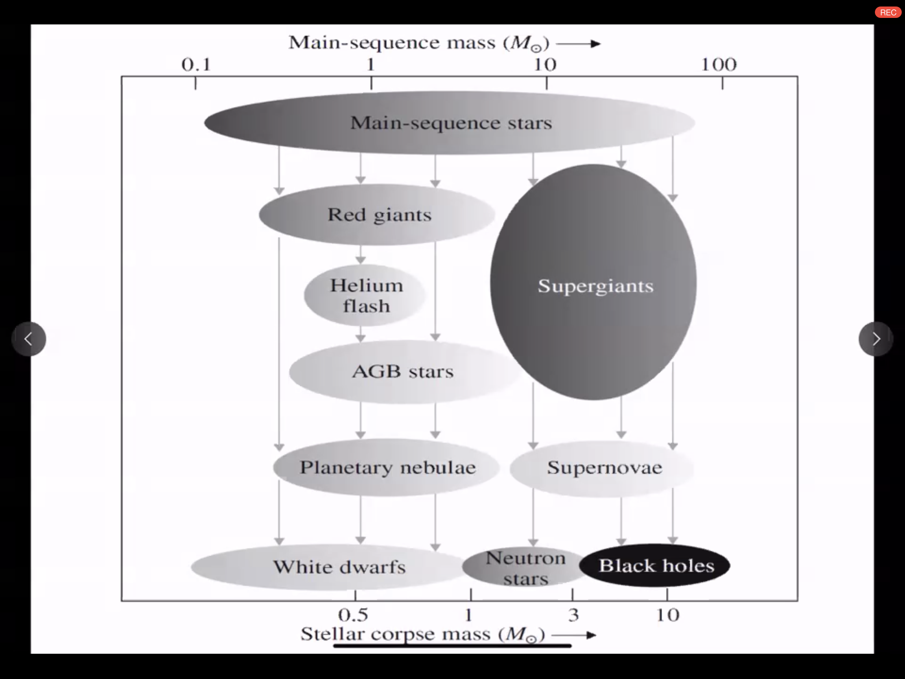  

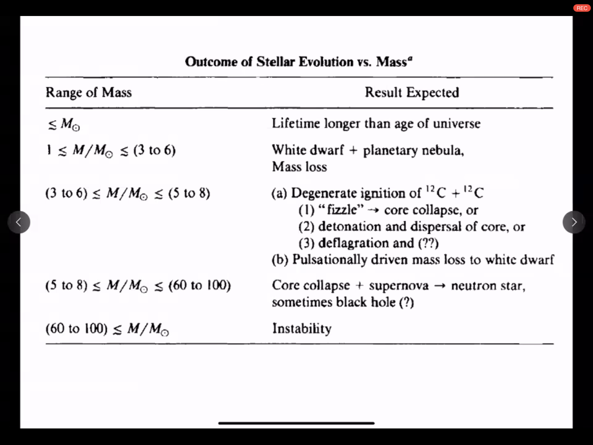  

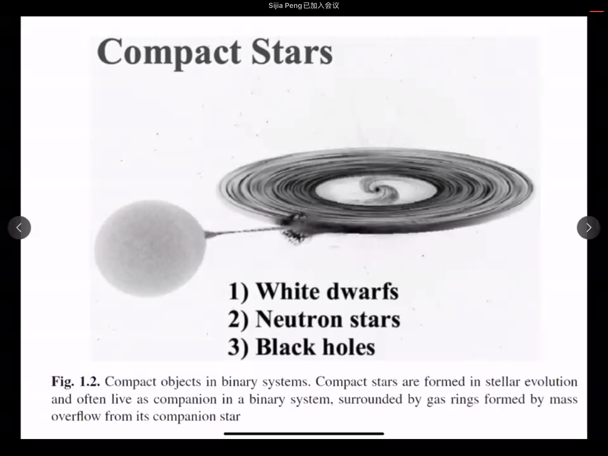  

  
TypeIa Supernova：  
When the mass of an accreting white dwarf increases to the Chanderasekhar limit, this star explodes as an SN Ia.

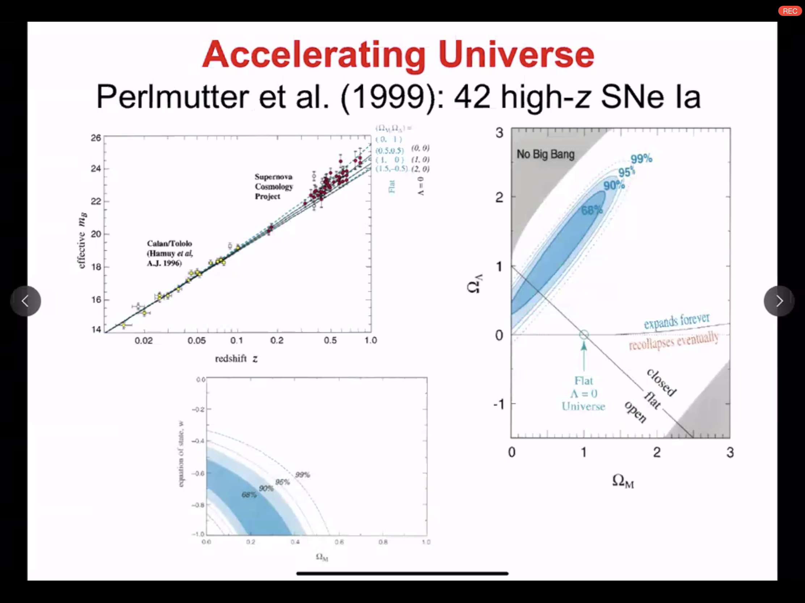

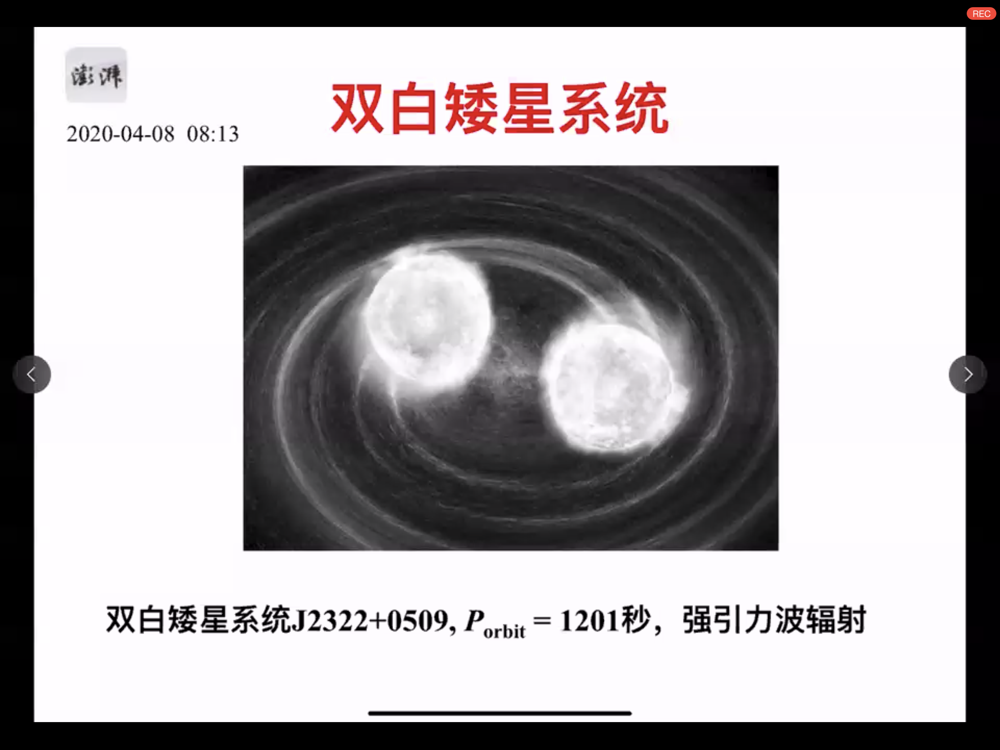
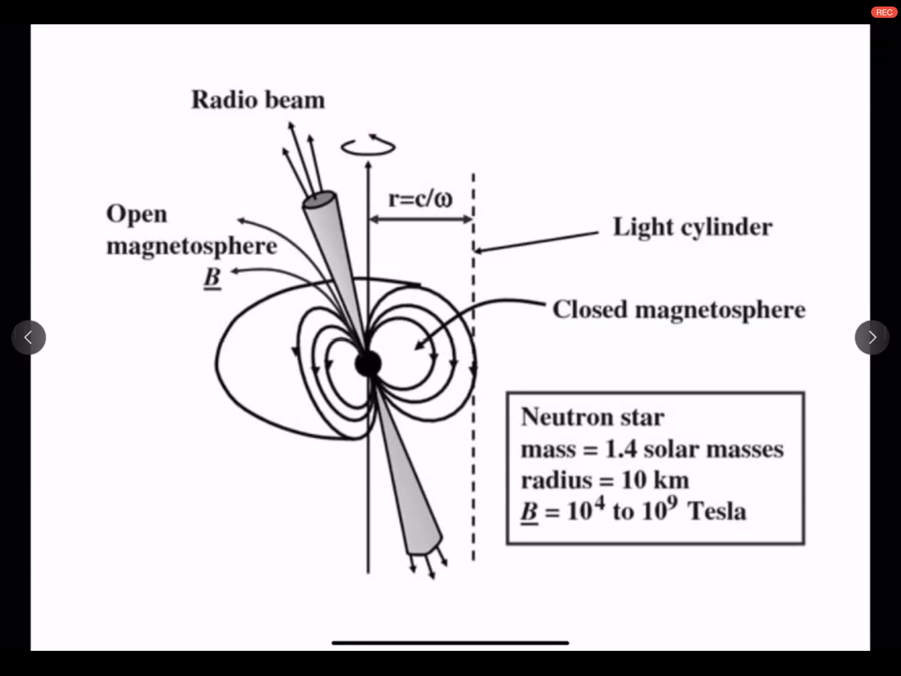
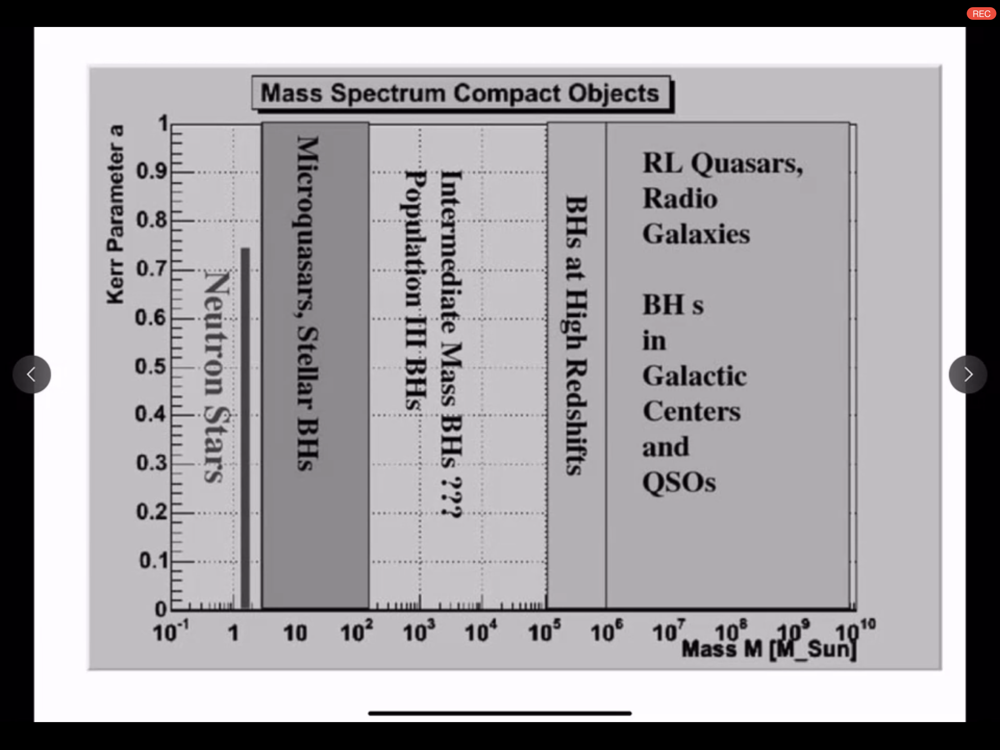

01_massplot.PNG

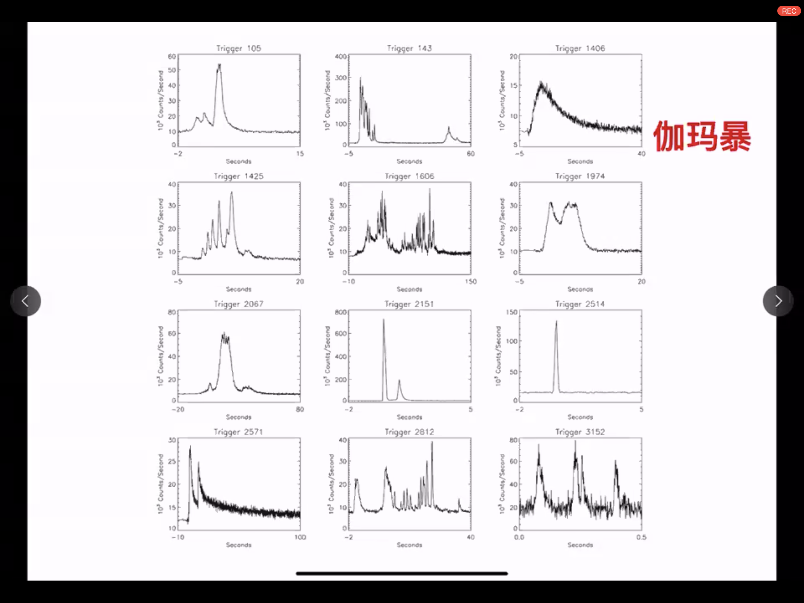
恒星级黑洞或中子星诞生时的爆发

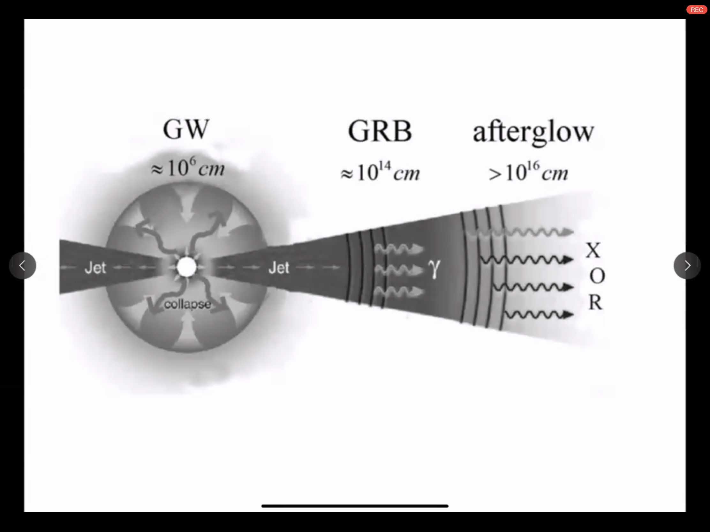
### 不同天体的密度

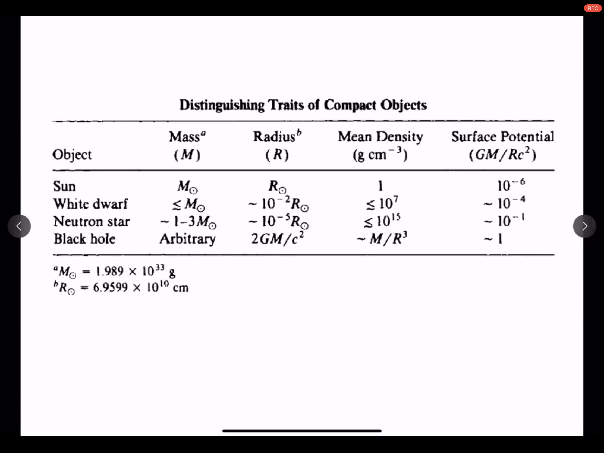
|Object| Mass|Radius|MeanDensity| 表面引力势|  
| :-----| ----: |----: |----: | :----: |  
|太阳|M|R|1|$10^{-6}$|
|白矮星|<M|$10^{-2}$R|<=$10^{7}$|$10^{-4}$|
|中子星|1-3M|$10^-5$R|<=$10^{15}$|$10^{-1}$|
|黑洞|Aibitrary|$\frac{2GM}{c^2}$|~$\frac{M}{R^2}$|1|

## 未来的多波段引力波观测设备

>Einstein Telescope 1Hz-10kHz  
>Lisa & 天琴&太极 0.1mHz~1Hz  
>脉冲星定时阵列 $10^{-10}Hz~10^{-6}Hz$  
>阿里 原初引力波在CMB的遗迹  
>高能卫星: Swift Fermi SVOM
>HXMT: 硬X射线调制望远镜("慧眼")  
>五百米口径球面射电望远镜

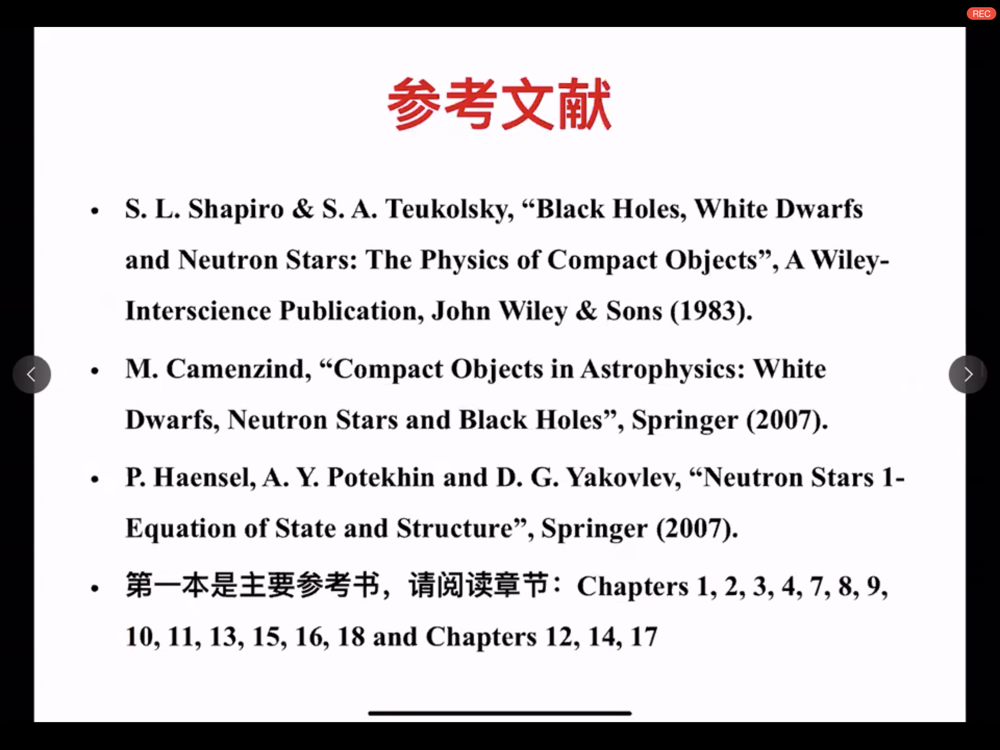
参考文献
> S.K> Shapiro & S.A> Teukolsky,"Black Holes, White Dwarfs and Neutron Stars: The Physics of Compact Objects", A Wiley-Interscience Publication, John Wiley & Sons(1993)  
> M. Camenzind,"Compact Objects in Astrophysics: White Dwarfs, Neutron Stars and Black Holes", Springer(2007)  
> P.Haensel, A.Y. Potekhin and D.G.Yakovkev,"Neutron Stars1-Equation of State and Structure",Springer(2007).  
> 第一本书1,2,3,4,7,8,9,10,11,13,15,16,18, and Chapters 12,14,17