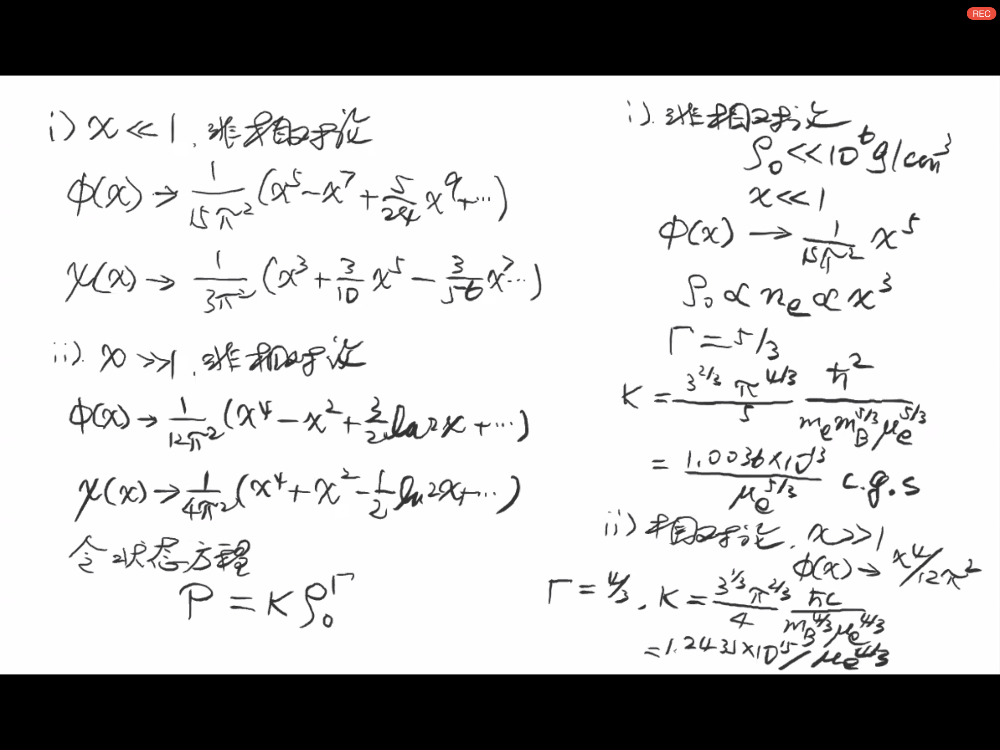
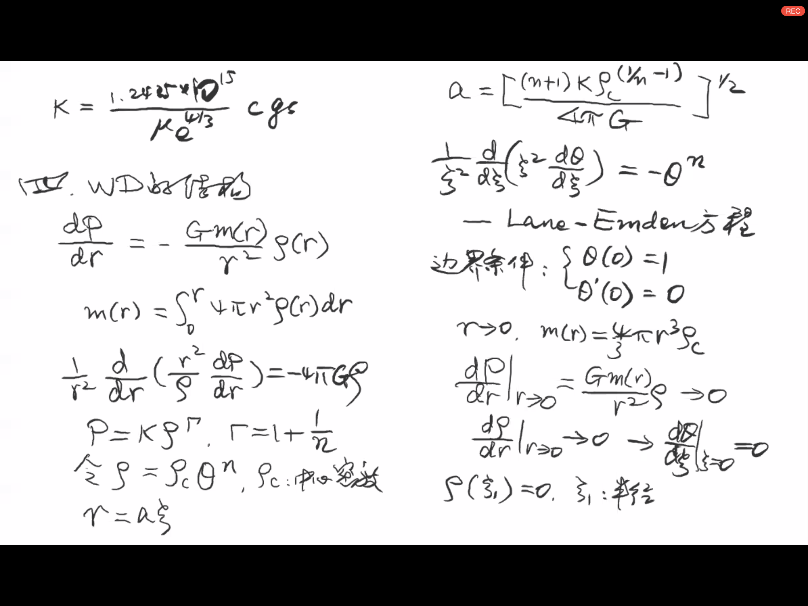
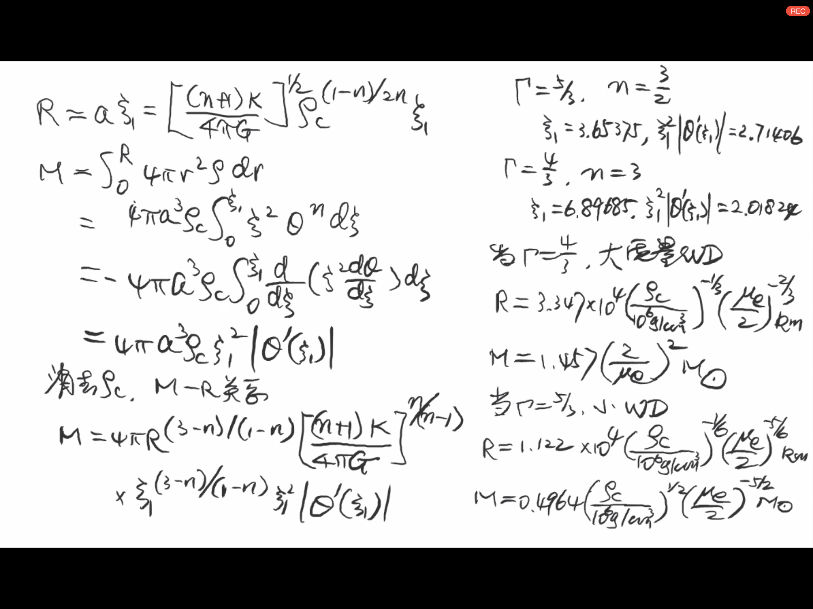
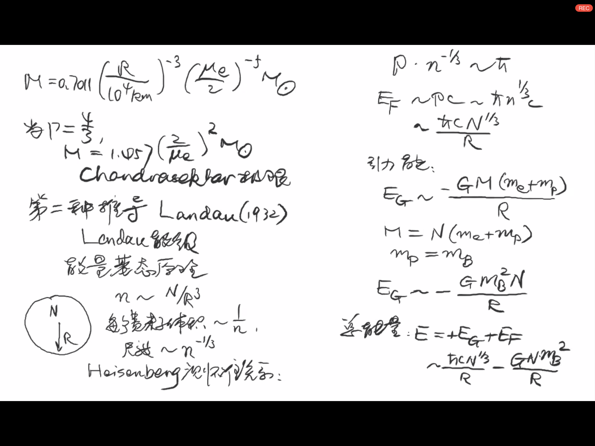

# 第二章 白矮星

## 回顾
WD 
$M~1M_{\odot},R~5000km$  
$\rho ~ 10^{6}g/cm^{3}$  
最有名的是 Sirius B  
$M~ 0.75 -0.95 M_{\odot}$
$L~\frac{1}{360}L_{\odot}~10^{31}erg/s$  
Adam 1915: 
Teff ~8000k  
$L=4\pi R^2 \sigma T^4$  
$R=18800 km$
Eddington (1908): 有一类天体与太阳质量相似但半径比天王星还小很多

Adam (1925) 
$\Delta Z=(1-\frac{2GM}{Rc^2})^{-1/2}-1$  
有前面得到的M/R与红移得到的M/R一致,因此验证了

Eddington 1926   
* 评价Adam的工作一石二鸟：
   - 验证了广义相对论
   - $\rho ~2000 \rho_{白金}$
  
* Dirac 1926.08 ~ Fermi Dirac 分布  
   - 费米字在量子态的概率分布只能小于等于1  
* Fowler 1926.12 
   - 满足Fermi Dirac分布的压强：电子简并压强 ；与引力平衡  
* Chandrasekhar 1930  
   - 必须要考虑狭义相对论  
   - 电子的能量$E_e=\sqrt{p^2c^2+m^2_e c^4}$
   - $P_e\propto \rho^{4/3}$
* Chandrasekhar 1930   极限  
   - $M_{ch}\sim 1.4M_{\odot}$  
* Landau 1932 提出中子星 
   -  发现中子 
   -  1967年发现脉冲星  
* Kaplan 1949 广义相对论的效应
   -  白矮星的质量半径关系M-R 

## 简并的开始

恒星->Fermi-Dirac分布

* 恒星的结构：  
   - 假定区域内面积为A，壳层r+dr，
   - $m(r0)=\int_0^r \rho 4\pi r^2dr$
   - $[-P(r+dr)+P(r)]=\frac{Gm(r)}{r^2}dm$
   - 流体静力学平衡$\frac{dP}{dr}=\frac{Gm(r)}{r^2}dm$

从流体静力学平衡开始讨论：
方程右边积分:  
$W=-\int^R_0\frac{Gm(r)}{r}\rho 4\pi r^2dr$  
$W=\int^R_0\frac{dP}{dr}4\pi r^3dr$  
$W=-3\int^R_0\rho4\pi r^3dr$  
所以称呼上边方程为Virial定理  

假定$P= K\rho_0^{\Gamma}$,考虑能量守恒  
绝热演化中，内能的变化应该是
$d(\frac{\epsilon}{\rho_0})=-Pd\frac{l}{\rho_0}$
绝热$dQ=0$  
$\epsilon=\rho_0 c^2+\frac{\rho}{\Gamma-1}$  
$\epsilon'=\frac{\rho}{\Gamma-1}$  
$W=-3(\Gamma-1)U$ <-维里定理

$U=\int^R_0\epsilon 4\pi r^2dr$   
$E=W+U=-\frac{3\Gamma-4}{3(\Gamma-1)}|W|$  
$W\sim -\frac{GM^2}{R}$  

Maxwell -Boltzmann 分布
$P=\frac{\rho_0}{\mu mu_u}kT$  
维里定理：  
* $-W=3\int^R_0 P 4\pi r^2dr$  
  - $=\frac{3kT}{mu m_u}\int^R_0  4\pi r^2dr$  
  - $=\frac{3M}{mu m_u}RT$  
  - $=3\times 2 \times \frac{1}{2}kT *N_{粒子数}$  

$-W=2U$  
$W+2U=0$  
$\bar{T}\propto\frac{M}{R}, \bar{\rho}\propto \frac{M}{R^3}$  

* $\Delta P_e \sim <(\vec{P_1}-\vec{P2})^2>^(1/2)=<2\vec{P_1}^2>^{1/2}$
  - $\sim (6m_ek\bar{T})^{1/2}$

$\frac{3}{2}k\bar{T}=\frac{P_1^2}{2m_e^2}$  

$\Delta P_e\propto(\frac{12meGMm_u \mu}{7R})^{1/2}$  
$(\Gamma \sim 5/3)$

$\Delta q_e\sim(\frac{\mu_e m_u}{\rho_0})^{1/3}$  
$\Delta q_e\sim(\frac{4\pi \mu_e m_u R^3}{3M})^{1/3}$   
$(\Delta p_e \Delta q_e)^3\sim\frac{4\pi}{3}(\frac{12\mu}{7})^{3/2}[(Gm_eR)^{1/2}m_u^{5/6}M^{1/6}])$

代入太阳质量的

$~40[1\times 10^{-26}(\frac{M}{M_{\odot}}^{1/6}(\frac{R}{R_\odot})^{1/2}g cm^2 s^{-1})^3]$  

$\sim 180h^3 (\frac{M}{M_{\odot}}^{1/2}(\frac{R}{R_\odot})^{3/2}$
当$M~M_{\odot},R\sim\frac{R_{\odot}}{30}$  

$(\Delta p_e \Delta q_e)^3\sim h^3$

Fermi Dirac 分布
$R_{WD}<\frac{R_{\odot}}{30}$

## 简并压强

费米子组成的气体在温度低密度高的时候必须考虑

$f=\frac{1}{e^{(\epsilon_e-\mu)/kt}+1}$ 注意+1和-1,+1是费米狄拉克分布，-1是玻色爱因斯坦分布

相空间中$(\vec{x},\vec{p})$

如果$\rho很大$，T很小，$T\rightarrow0$
* f=
  - 0 $\epsilon_e>\mu$
  - 1 $\epsilon_e<\mu$

$n_e=\frac{2}{}\int_0^{\infty} 4\pi P_e^2 dp V$  
$\mu=\sqrt{P_F^2c^2=m_e^2c^4}$  

$P_F$ Fermi动量
$\mu=E_F$ Fermi能   
$n_e=\frac{2}{h^3}\int_0^{\infty} 4\pi P_e^2 dp$  
$n_e=\frac{8\pi}{h^3}P_F^3$  
$\hbar=\frac{h}{2\pi}$  
$n_e=\frac{P_F^3}{3\pi^2\hbar }$  
$P_F=(3\pi^2n_e)^{1/3}\hbar$

$X=\frac{P_F}{m_ec}$  
$n_e=\frac{1}{3\pi^2\lambda_e^3}X^3$  
$\lambda_e$ Compton 波长  
$\lambda_e=\frac{hbar}{m_ec}$  
压强
$P_e=\frac{1}{3}\frac{2}{h^3}\int^{P_F}_0\frac{p^2 c^2 4\pi p^2}{(p^ 2 c^2+m_e^2c^4)^{1/2}}dp$

$\Phi(x)=\frac{1}{8\pi^2} x(1+x^2)^{1/2} (2x^{2/3}-1)+ln[x+(1+x^2)^{1/2}]$

能量密度
$\epsilon_e=\frac{2}{h^3}\int_0^{P_F}(p^2c^2+m^2_ec^4)^{1/2}4\pi p^2dp$    
$\epsilon_e=\frac{m_e c^2}{\hbar^3_e}\Chi(x)$  
$\Chi(x)=\frac{1}{8\pi^2}(x(1+x^2)^{1/2}(1+2x^2)-ln[x+(1+x^2)^{1/2}])$

### 2020-04-16 

  

#### $x\ll 1$ 非相对论情形   
$\phi(x)→\frac{1}{15\pi^2}(x^5-x^7+\frac{5}{24}x^9+x...)$  
$\chi(x)→\frac{1}{3\pi^2}(x^3+\frac{3}{10}x^5-\frac{3}{56}x^7...）$  
#### $x\gg 1$ 相对论  
$\phi(x)→\frac{1}{12\pi^2}(x^4-x^2+\frac{3}{2}ln(2x)...)$  
$\chi(x)→\frac{1}{4\pi^2}(x^4+x^2-\frac{1}{2}ln(2x)...）$  
 
####  令状态方程 $P=K\rho_0^{\Gamma}$

1)非相对论
$\rho_0\ll 10^6 g/cm^3$  
$x\ll 1$

$\phi(x)→\frac{1}{15\pi^2}x^5$  
$\rho_0\propto n_e∝ x^3$  
$\Gamma=\frac{5}{3}$

$K= \frac{3^{2/3}\pi^{4/3} }{5} \frac{\hbar^2}{m_em_b^{5/3}\mu_e^{5/3}}$  
$=\frac{1.0036\times 10^{13}}{\mu_e^{5/3}}c.g.s$
ii) 相对论
$x\gg 1$
$phi(x)→x^4/12\pi^2$  
$\Gamma=4/3$  
$K=3^{1/3}\pi^{2/3}/4 * \frac{\hbar}{m_B^{4/3}\mu_e^{4/3}}$  
$K=\frac{1.2435*10^{15}}{\mu_e^{4/3}cgs}$

### WD的结构
  

$\frac{dP}{dr}=-\frac{Gm(r)}{r^2}\rho(r)$  
$m(r)=\int_0^{r}4\pi r^2 \rho(r) dr$  
$\frac{1}{r^2}\frac{d}{dr}(\frac{r^2}{\rho}\frac{dP}{dr})=-4\pi G\rho$  
$P=K\rho^{\Gamma}$   
$\Gamma=1+\frac{1}{n}$  
令$\rho=\rho_c \theta^n$, $\rho_c$中心密度  
$r=a\xi$  
$a=[\frac{(n+1)K\gamma_c^{1/n-1}}{4\pi G}]^{1/2}$  
Lane Emden $\frac{1}{\xi^2}\frac{d}{d\xi}(\xi^2\frac{d \theta}{d\xi}=-\theta^n$  

边界条件：
   * $\theta(0)=1$
   * $\theta'(0)=0$

$r→0$, $m(r)=\frac{4}{3}\pi r^3\rho_c$  

$\frac{dP}{dr}|_{r→0}=\frac{Gm(r)}{r^2}\rho→0$  
$\frac{dP}{dr}|_{r→0}→$

  
$R=a\xi_1=[\frac{(n+1)K}{4\pi G }]^{1/2} \rho_c^{(1-n)/2n} \xi_1$
$M=\int_0^{R}4\pi r^2\rho dr$  
$M=4\pi a^3\rho_c\int_0^{\xi_1}\frac{d}{d\xi}(\xi^2\frac{d\theta}{d\xi})d\xi$  
$M=4\pi a^3\rho_c\int_0^{\xi_1}\frac{d}{d\xi}(\xi^2\frac{d\theta}{d\xi})d\xi$

$\Gamma=\frac{5}{3}$, $n=\frac{3}{2}$

$\xi_1=3.65375$,$\xi_1^2|\theta'(\xi_1)|=2.71406$

$\Gamma=\frac{4}{3}$, $n=3$

$\xi_1=6.89685$,$\xi_1^2|\theta'(\xi_1)|=2.0824$

当$\Gamma=\frac{4}{3}$ 大质量WD  
$R=3.347\times10^4(\frac{\rho_c}{10^6 g/cm^3})^{-1/3}(\frac{\mu_e}{2})^{-2/3}km$  
$M=1.457(\frac{2}{\mu_e})^2M_\odot$  
当$\Gamma=\frac{5}{3}$ 小质量WD  
$R=1.122\times10^4(\frac{\rho_c}{10^6 g/cm^3})^{-1/6}(\frac{\mu_e}{2})^{-5/6}km$  
$M=0.4964(\frac{\rho_c}{10^6 g/cm^3})^{-1/2}(\frac{2}{\mu_e})^{-5/2}M_\odot$  

$M=0.7011(\frac{R}{10^4km})^{-3})(\frac{\mu_e}{2})^{-5}M_\odot$

当$\Gamma=\frac{4}{3}$  
Chandrasekhar极限 $M=1.457(\frac{2}{\mu_e})^2M_\odot$  

Chandrasekhar极限的第二种推导方法：Landau(1932)  
Landau能级  
能量基态原理  
考虑N个费米子在半径为R的球体内  $n=\frac{N}{R^3}$  
每个费米字的体积$\sim \frac{1}{n}$  
尺度$\sim n^{-1/3}$  
Heisenberg原理：  
动量*尺度 近似 普朗克常数

$p*n^{-1/3}\sim\hbar$  
$E_F\sim p_c\sim \hbar n^{1/3} c\sim \frac{\hbar cN^{1/3}}{R}$  

引力能：
$E_G\sim-\frac{GM(m_e+m_p)}{R}$   

$M=N(m_e+m_p)\sim Nm_p$
质子质量$m_e$用重子质量$m_B$代替

$E_G\sim-\frac{Gm_B^2N}{R}$  
总能量$E=E_G+E_F\sim \frac{\hbar cN^{1/3}}{R}-\frac{GM(m_e+m_p)}{R}$ 

令E=0  
$\frac{\hbar cN^{1/3}}{R}-\frac{GM(m_e+m_p)}{R}=0$
$N_1=(\frac{\hbar c}{Gm_B^2})^{1/2}$   
1） 当N>$N_1$ E<0;  
   * $R↓,E\downarrow$ 无基态，总是塌缩的   

2） 当N<$N_1$ 存在稳定态 E>0:
      $R↑,E\downarrow$ 

$p_F<m_ec$非相对论  
$E_F\sim\frac{p_F^2}{2m_e}∝\frac{1}{R^2}$  
$E_F=c/R^2$  
$E=E_F+E_G=\frac{c}{R^2}-\frac{GNm_B^2}{R}$  
$N_1=(\frac{\hbar c}{Gm_B^2})^{1/2}=2\times10^{57}$   
$M_{max}=N_1m_B\sim1.5 M_{\odot}$  

第三种推导  
用流体静力学方程 
$\rho_c=Constant$  
$\frac{dP}{dr}=-\frac{GM_r\rho}{r^2}=-\frac{G(\frac{4}{3}\pi r^3\rho)\rho}{r^2}$  
$=-\frac{4}{3}\pi G\rho r$
从表面积分到任意r  
$P(r)=\frac{2}{3}\pi G \rho^2(R_{WD}^2-r^2)$  
当$r→0$  
$P_c=\frac{2}{3}\pi G \rho^2 R^2_{WD}$

1)小质量白矮星
$\Gamma =\frac{5}{3}$  
$P_C=\frac{2}{3}\pi G\rho^2 R^2_{WD}=K_{5/3}\rho^{5/3}$  
$→\rho^{1/3}R^2_{WD}=Constant$  
$\rho=\frac{M}{\frac{4}{3}\pi R^3_{WD}}$  
所以小质量白矮星  
$R^3_{WD}M_{WD}=Constant$  
2）大质量的
$\Gamma =\frac{4}{3}$  
$P_C=\frac{2}{3}\pi G\rho^2 R^2_{WD}=K_{4/3}\rho^{4/3}$  
$\rho^{2/3}R^{2}_{WD}=const$   
$M=const$